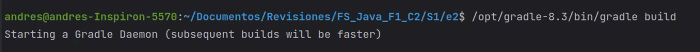
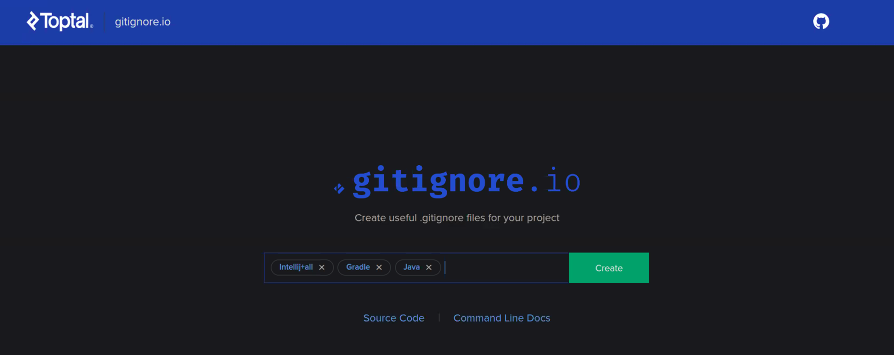

## Create Project
1.- Open an empty folder

2.- Create an file `build.gradle`


### Work with Java
1.- Go to "Execute Gradle Task" to synchronize the project to work with Java

2.- Write the next code to work with java in `build.gradle` file
```bash
plugins {
    id "java"
}
```

3.- Synchronize the plugins
Select the fourth option `Reload All Gradle Project`
Select the Gradle command `gradle tasks` lists all the tasks that can be executed in the project

4.- Reload the project
Select the first option `Reload All Gradle Project`

5.- Build the Project
Select the fourth option `Reload All Gradle Project`
Select the Gradle command `gradle build` to execute the program

Note: To Build the project in Visual Studio Code you can write the next code
`/opt/gradle-8.3/bin/gradle build`


6.-
Write the next code to work with java in `build.gradle` file
```bash
jar {
    manifest {
        attributes"Main-Class": "HelloWorldExample"
    }
}
```

7.- Build the Project again Step 5 (`gradle build`)

8.- Exceute the JAR file
Write in the terminal 
`java -jar build/libs/Example02.jar`

TIP:
>> - Create .gitignorefile
> 
> Go to  [Toptal](https://www.toptal.com/developers/gitignore)
