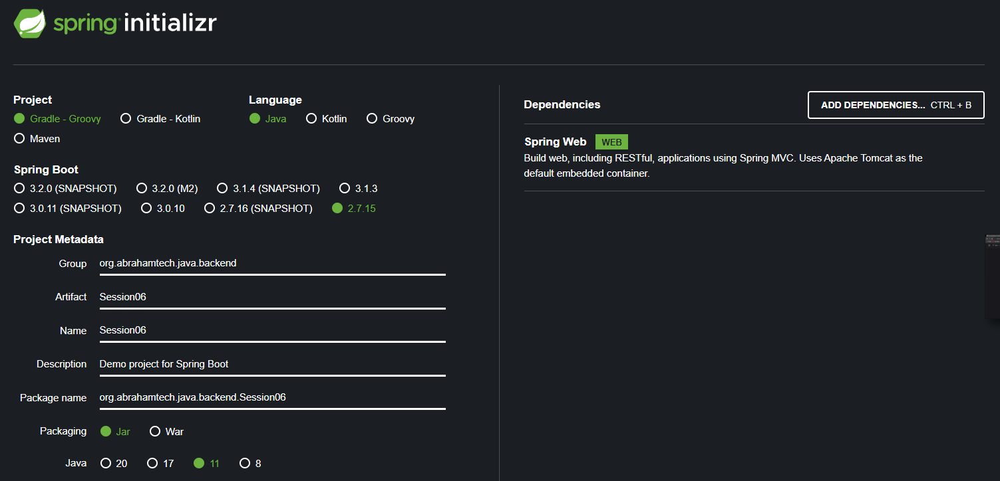

Spring Project Generator

[Link](https://start.spring.io/)

For **Java version:** `11 or 8`
So Spring Boot `2.7.15` version was selected 

For **Java version:**  `20 or 17`
So Spring Boot `3.1.3` version was selected 

Add Dependency `Spring Web`




### Routes

#### POST: 
* http://localhost:8080/api/v1/user/7
* http://localhost:8080/api/c1/user/

* http://localhost:8080/api/v2/user

#### GET: 
Only for `Challenge01`
* http://localhost:8080/api/v1/user?id=1&rol=Teacher


### Json for POST request

```bash
{
  "name": "Beto",
  "lastName": "Bedu",
  "user": "beto123",
  "email": "beto@bedu.com",
  "password": "beto123"
}
```


### Example 02

Return the object user
```bash
{
  "name": "Beto",
  "lastName": "Bedu",
  "user": "beto123",
  "email": "beto@bedu.com",
  "password": "beto123",
  "address": {
    "street": "St Monica",
    "postalCode": "37596",
    "number": "456"
  }
}
```

