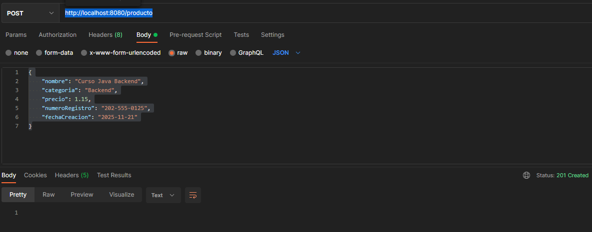
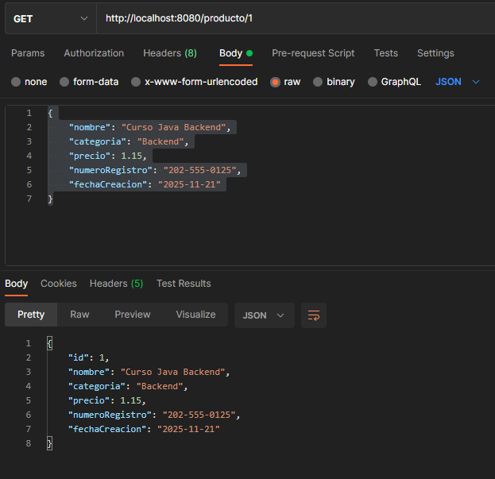

# Example #1

## Change User and Password

In the resources directory find or create the application.properties file.


Place the following content in the file (customize the content if necessary):

spring.jpa.hibernate.ddl-auto=update
spring.jpa.hibernate.generate_statistics=true
spring.jpa.properties.hibernate.dialect=org.hibernate.dialect.MySQL5Dialect
spring.datasource.driver-class-name=com.mysql.cj.jdbc.Driver
spring.datasource.url=jdbc:mysql://localhost:3306/bedu?serverTimezone=UTC
spring.datasource.username=**<user>**
spring.datasource.password=**<password>**

## Send Request

Run the application and send the following request from Postman:

```bash
{
    "name": "BeduORG",
    "contactemail": "contact@bedu.org",
    "numberEmployees": "20",
    "Direction Direction"
}
```

you should have the following response in the Postman console:


Check the database, the CUSTOMER table must have been created automatically and must have the record stored with the data sent from Postman:


# Challenge #1

## Get information stored in the database

The Product class must have the following attributes:

```bash
    private Long id;
    private String name;
    private String category;
    private float price;
    private String recordNumber;
    private LocalDate creationDate;
```

When making a request to create a new resource with the following content at http://localhost:8080/product:


```bash
{
    "name": "Java Backend Course",
    "category": "Backend",
    "price": 1.15,
    "registrationnumber": "202-555-0125",
    "creationdate": "2025-11-21"
}
```

You should get the following answer:




And when you retrieve the new custo created, you should get the following response http://localhost:8080/producto/1


