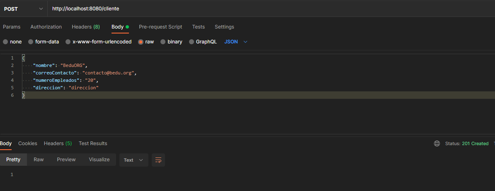
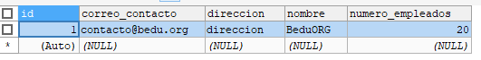

## Send Request

Run the application and send the following request from Postman:

```bash
{
    "name": "BeduORG",
    "contactemail": "contact@bedu.org",
    "numberEmployees": "20",
    "Direction Direction"
}
```

you should have the following response in the Postman console:


Check the database, the CUSTOMER table must have been created automatically and must have the record stored with the data sent from Postman:

